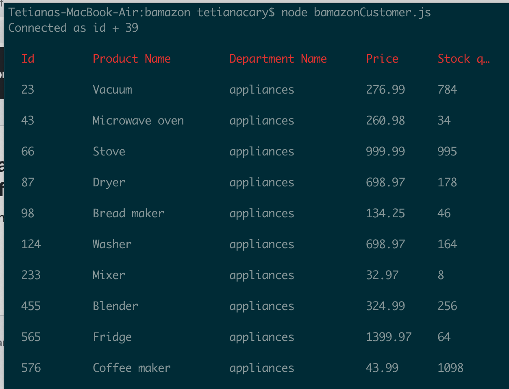
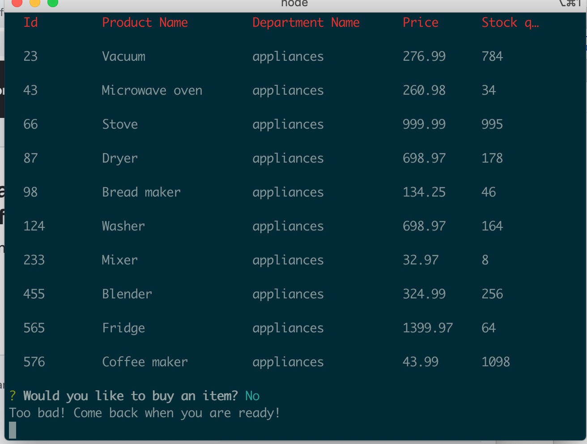
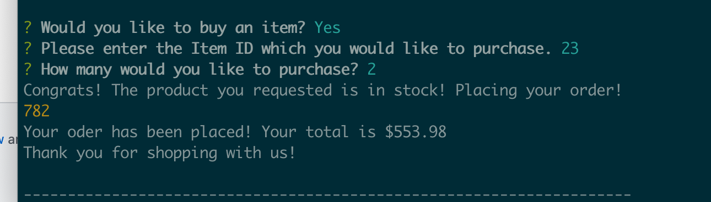
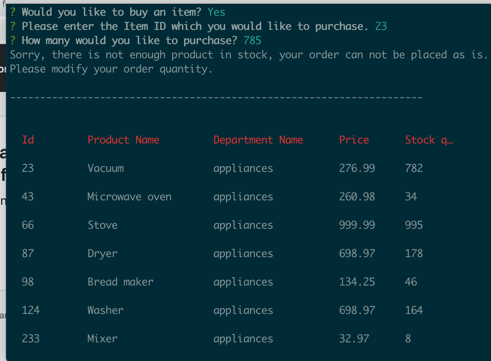

# bamazon

Welcome to my store! In this assignment we were supposed to create a MySQL Database called bamazon.

Then create a Table inside of that database called products.

The products table has each of the following columns:

id (unique id for each product)

product (Name of product)

department

price (cost to customer)

stock_q (how much of the product is available in stores)

I populate this database with 10 different products. 
Then created a Node application called bamazonCustomer.js. Running this application will first display all of the items available for sale. Included the ids, names, and prices of products for sale.

The app then prompts users with 3 messages.
The first message asks the user if they would like to buy a product.
The second asks them the ID of the product they would like to buy.
The third message asks how many units of the product they would like to buy.

Once the customer has placed the order, my application checks if the store has enough of the product to meet the customer's request.

If not, the app logs a phrase like Insufficient quantity!, and then prevents the order from going through.

However, if store does have enough of the product, fulfill the customer's order.

This means updating the SQL database to reflect the remaining quantity.
Once the update goes through, show the customer the total cost of their purchase.

HERE is an example of this command.

